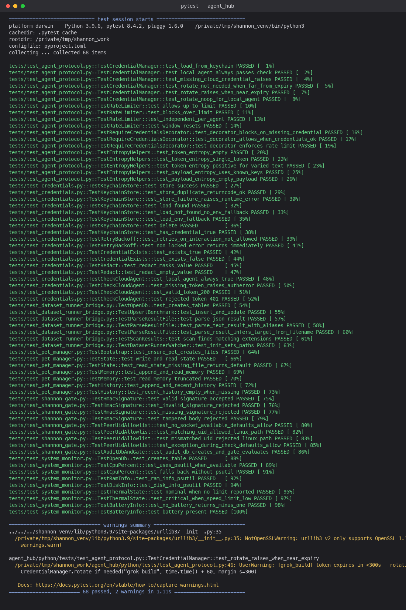

# Agent Hub

A macOS multi-agent coordination layer, added alongside the Shannon entropy
library but functionally and architecturally independent from it — it does
not link against or modify any of the core C++/CUDA code.

It provides:
- a menu-bar Swift "pill" UI (`swift/AgentHubApp.swift`) showing live agent
  status and system resource usage,
- a Python gate daemon (`python/shannon_gate.py`) that brokers messages
  between local and cloud AI agents over a Unix socket and an optional HTTP
  endpoint, running Shannon-entropy checks to catch low-information or
  divergent agent output before it propagates,
- a per-agent persistent memory system (`python/pet_manager.py`),
- macOS Keychain-backed credential storage (`python/credentials.py`) — no
  secrets are ever written to disk in plaintext,
- a thin bridge (`python/tools/dataset_runner_bridge.py`) for feeding
  external benchmark/dataset runner output into the hub.

See `ARCHITECTURE.md` for the original design document (diagrams, threat
model, open design questions) and `docs/AGENT_HUB.md` for a summary plus the
auth-hardening changes applied when this was integrated into the Shannon
repo.

## Directory layout

```
agent_hub/
├── README.md              — this file
├── ARCHITECTURE.md         — original architecture / threat model doc
├── docs/
│   ├── AGENT_HUB.md        — architecture summary + hardening notes
│   └── img/tests_passing.png
├── swift/
│   └── AgentHubApp.swift   — menu-bar HUD
└── python/
    ├── shannon_gate.py     — gate daemon (Unix socket + HTTP)
    ├── agent_protocol.py   — client library for agents
    ├── credentials.py      — Keychain-backed credential store
    ├── pet_manager.py      — per-agent persistent memory
    ├── system_monitor.py   — CPU/RAM/disk/thermal/battery polling
    ├── tools/
    │   └── dataset_runner_bridge.py
    └── tests/              — pytest suite (Keychain access is mocked)
```

## Relationship to the core Shannon library

The core library (`src/`, `python/` at the repo root, etc.) computes Shannon
entropy over data; this directory is a separate, self-contained subsystem
that happens to use Shannon-entropy scoring internally to gate AI-agent
messages. No files outside `agent_hub/` were modified to add this.

## Running the tests

```bash
cd agent_hub/python
pip install pytest requests aiohttp psutil
python3 -m pytest tests/ -v
```

Keychain access is fully mocked via `unittest.mock.patch` in every test —
the suite never touches the real macOS Keychain.

Latest verified run: **68 passed, 0 failed** (2 non-fatal warnings from
intentional expiry/rotation test cases).



## Security notes

- All Keychain items use `kSecAttrAccessibleWhenUnlockedThisDeviceOnly`.
- Keychain reads/writes retry with backoff on a locked Keychain, then raise
  `KeychainUnavailableError` — there is no plaintext fallback.
- Outgoing agent requests require valid, non-expiring-soon credentials
  (`@require_credentials`) and are rate-limited (60/min per agent, 429 +
  `Retry-After` on breach).
- The gate daemon enforces a Unix-socket peer UID allowlist, a Bearer token
  on every HTTP endpoint, and HMAC-SHA256 request-body signing
  (`X-Shannon-Sig`).
